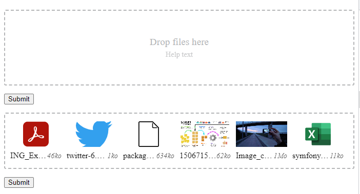

# **Drop Zone Custom element**

[](https://www.npmjs.com/package/@chcodes-hamza/drop-zone)

it 's a custom element that enables drop zone to manage file.
A reusable web component.



## Usage 

### With npm
Install the package using npm or yarn

```bash
npm i @chcodes-hamza/drop-zone
# or
yarn add @chcodes-hamza/drop-zone
```

Then import it in your script

```js
import '@chcodes-hamza/drop-zone'
```

### With unpkg.com

```html
<script type="module" src="https://unpkg.com/@chcodes-hamza/drop-zone"></script>
```

Then use the custom element in your html using `is="drop-zone`.

```html
<form action="where-ever-you-want" method="post" enctype="multipart/form-data">
    <input type="file" multiple name="files[]" label="Drop files here."
           help="this is a help text" is="drop-zone" />
    <p>
        <button type="submit">Submit</button>
    </p>
</form>
```